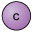
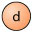

# 3  Quarks

The other group of fundamental particles which was introduced in the previous section are the quarks (nope, it’s not just a tasty cheese!). In 1964, two independent researchers were working on theories to explain strong interaction symmetry in particle physics. These were Murray Gell-Mann and George Zweig. These scientists proposed that the properties of hadrons (more on these in the next section) could be explained if they were composed of smaller constituents. What is known now to be quarks!

Figure 1 Murray Gell-Mann (left) and George Zweig (right).

Like the leptons, there are also, handily, 6 varieties of these. They are known as the six flavours of quarks, labelled by the letters u, d, c, s, t and b, which stand for __up__, __down__, __charm__, __strange__, __top__ and __bottom__. The up, charm and top quarks each carry a positive charge of +23e, while the down, strange and bottom quarks each carry a negative charge of −13e. 

Like the leptons, the six quarks are often grouped into three generations on the basis of their mass, with the first generation being the least massive. To each quark, there corresponds an antiquark, with the opposite charge and the same mass. These are denoted by the symbols u¯, d¯, c¯, s¯, t¯ and b¯. So anti-up, anti-charm and anti-top antiquarks each carry a negative charge of −23e, while anti-down, anti-strange and anti-bottom antiquarks each carry a positive charge of +13. 
<table xmlns:str="http://exslt.org/strings">
<caption>__Table 2__ Three generations of quarks </caption>
<tbody>
<tr>
<th></th>
<th>1st generation</th>
<th>2nd generation</th>
<th>3rd generation</th>
</tr>
<tr>
<td class="highlight_" rowspan="" colspan="">Quarks with charge +23e</td>
<td class="highlight_" rowspan="" colspan="">  </td>
<td class="highlight_" rowspan="" colspan="">  </td>
<td class="highlight_" rowspan="" colspan="">  </td>
</tr>
<tr>
<td class="highlight_" rowspan="" colspan="">Quarks with charge −13e</td>
<td class="highlight_" rowspan="" colspan="">  </td>
<td class="highlight_" rowspan="" colspan="">  </td>
<td class="highlight_" rowspan="" colspan="">  </td>
</tr>
</tbody>
</table>

Of all the quarks, the up and down are the least massive of the flavours. The charm and strange quarks and antiquarks are more massive than the up and down quarks, and the top and bottom quarks and antiquarks are yet more massive still. 

