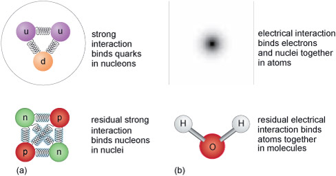

# 6  Strong interactions

As introduced in Section 4, the force that binds quarks together inside nucleons (i.e. neutrons and protons) is known as the __strong interaction__ and has a very short range. It operates essentially only within the size of a nucleon. 

When two up quarks and a down quark form a proton, or when two down quarks and an up quark form a neutron, the strong interaction has, largely, done its job, in much the same way, for example, that the electric interaction between a proton and an electron does its job by forming a hydrogen atom. 

In addition, there is a residual strong interaction between nucleons, which you can imagine as ‘leaking out’ of the individual protons and neutrons. This is sufficient to bind them together in nuclei and is similar in nature to the residual electromagnetic interactions between atoms that are responsible for the formation of molecules. 

__Figure 3__ (a) The strong interaction binds quarks together in nucleons. A residual strong interaction binds nucleons in nuclei. (b) The electrical interaction binds electrons and nuclei together in atoms. A residual electrical interaction binds atoms together in molecules. 

## 6.1  Gluons

It is amazing just how strong the strong interaction between quarks is. At a separation of around 10−15 m – the typical size of a proton or neutron – the force of attraction between a pair of quarks is equivalent to the weight of a 10-tonne truck! As might be suggested by its name, the strong force of attraction between two up quarks is much larger than the electric force of repulsion between them. It is this strong force that prevents quarks from being liberated in high-energy collisions. Free quarks are never seen to emerge from such processes: quarks only exist confined within baryons or mesons. It is as if they are stuck together with very strong glue. 

__Figure 4 __Schematic image from an old-style television monitor of the particle tracks resulting from a collision in the Large Electron–Positron (LEP) collider at CERN. 

A clue concerning the nature of this ‘quark glue’ can be seen in high-energy experiments such as those conducted at CERN. When high-energy beams of electrons are collided with equally high-energy beams of positrons travelling in the opposite direction, it often happens that hadrons emerge as a pair of jets, with each jet made up of a number of hadrons. 

The basic interaction that produces the pair of jets is as follows. First, the electron (e−) and positron (e+) annihilate each other and produce what is known as a __virtual photon__. The reason for this name is that the virtual photon only has a temporary existence and immediately undergoes a pair creation event, giving rise to a quark–antiquark pair. Their kinetic energy and mass energy is almost immediately converted into the kinetic energy and mass energy of many more matter and antimatter particles, including lots more quarks and antiquarks. The many quarks and antiquarks then combine to form a variety of hadrons, and it is only the hadrons that then emerge from the collision as a pair of jets.

__Figure 5__ An electron and a positron mutually annihilate each other to create a virtual photon which subsequently creates a quark–antiquark pair. The energy of the quark and antiquark are then transformed into many more quarks and antiquarks, which give rise to a pair of jets of hadrons. 

But this is not the whole story: sometimes *three* jets may be produced. This process involves a particle you haven’t met so far, the __gluon__. Gluons are the quanta of energy whose emission and absorption are regarded as the origin of strong interactions. They are responsible for ‘gluing’ the quarks strongly together inside hadrons. However, unlike photons – but like quarks and antiquarks – gluons cannot escape to large distances. 

Nonetheless, a quark (or indeed an antiquark) may emit a gluon. The mass energy and kinetic energy of the gluon is quickly turned into the mass energy and kinetic energy of further pairs of quarks and antiquarks. These in turn combine with each other to form various hadrons, and the hadrons produced from the gluon then give rise to a third jet emerging from the process. 

__Figure 6__ An electron and a positron mutually annihilate each other to create a virtual photon which subsequently creates a quark–antiquark pair. The quark emits a gluon, shown by the curly line. The energy of the quark, antiquark and gluon are then transformed into many more quarks and antiquarks, which give rise to three jets of hadrons. 

## 6.2  Quantum chromodynamics

The quantum theory of the strong interactions between quarks and gluons is called __quantum chromodynamics__ (QCD), always something impressive to drop into those dinner party conversations!

To understand why this theory is so called, you should note that ‘chromo’ comes from the Greek word for ‘colour’. The interactions between quarks and gluons are described in terms of a new property of matter that is called __colour charge__, by analogy with conventional electric charge. 

Just as electromagnetic interactions result from forces between electrically-charged particles, so strong interactions result from forces between colour-charged particles. However, whereas conventional electric charge comes in only one type that can either be positive or negative, colour charge comes in three types, each of which can be ‘positive’ or ‘negative’. 

These three types of positive colour charge are known as red, green and blue, and their negatives are antired (or the colour cyan), antigreen (or the colour magenta) and antiblue (or the colour yellow). Confusingly, it is important to disregard your ideas of colour and to note that colour charge has nothing to do with colours of light, it is merely a naming convention. 

Each quark can have any one of the three colour charges, and each antiquark can have any one of the three anticolour charges. So in effect, there are three versions of each type of quark: red up quarks, blue up quarks and green up quarks, for instance. 

Gluons each carry a combination of colour and anticolour charge (such as red–antiblue, blue–antigreen or green–antired), although they have zero electric charge. Leptons and photons do not have any colour charge associated with them. In all strong interactions there is therefore another conservation rule: colour charge is also conserved. 
<!--ITQ-->

#### Question

A red up quark emits a red-antiblue gluon. What colour charge does the up quark now have?

#### Answer

Since colour charge is conserved, the up quark must now have a blue colour charge.
<!--ENDITQ--><!--ITQ-->

#### Question

A green down quark absorbs a blue-antigreen quark. What colour charge does the down quark now have?

#### Answer

Since colour charge is conserved, the down quark must now have a blue colour charge.
<!--ENDITQ-->
This model helps to explain many phenomena, such as why the only possible hadrons are baryons (consisting of three quarks), antibaryons (consisting of three antiquarks) and mesons (consisting of one quark and one antiquark). 

Each of these composite particles has a net colour charge of zero. Any baryon must contain one quark with a red colour charge, one quark with a green colour charge, and one quark with a blue colour charge. By analogy with conventional colours: red + green + blue = white, a neutral colour with a net colour charge of zero. Likewise, antibaryons must contain one antiquark with an antired colour charge, one antiquark with an antigreen colour charge, and one antiquark with an antiblue colour charge. Again, this gives a net colour charge of zero. 

__Figure 7__ (a) Three colour charges combine to produce a net colour charge of zero (i.e. white). (b) Three anticolour charges combine to produce a net colour charge of zero (i.e. white). 

Similarly, the quark–antiquark pairs that constitute a meson must have the opposite colour charge to each other: red + antired (cyan) = white for instance, which is a net colour charge of zero again. 

Only particles with a net colour charge of zero are allowed to exist in an independent state, and this explains why single quarks and antiquarks are not seen in isolation. The locking up of quarks inside hadrons is referred to as __confinement__. Gluons do not have a net colour charge of zero either, so they too do not escape from strong interactions. Instead, gluons will decay into quark–antiquark pairs, which in turn create further hadrons. 

